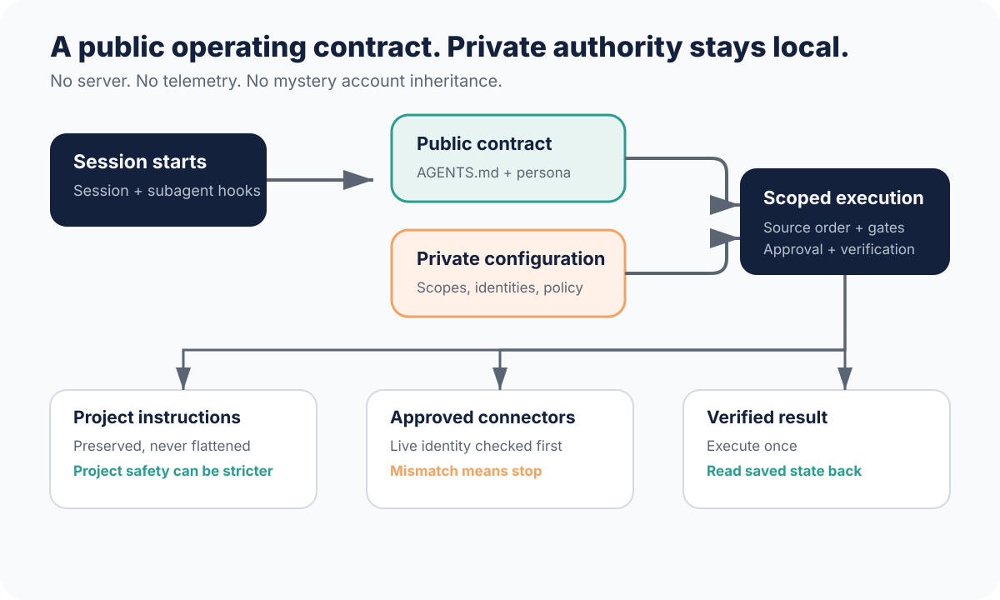
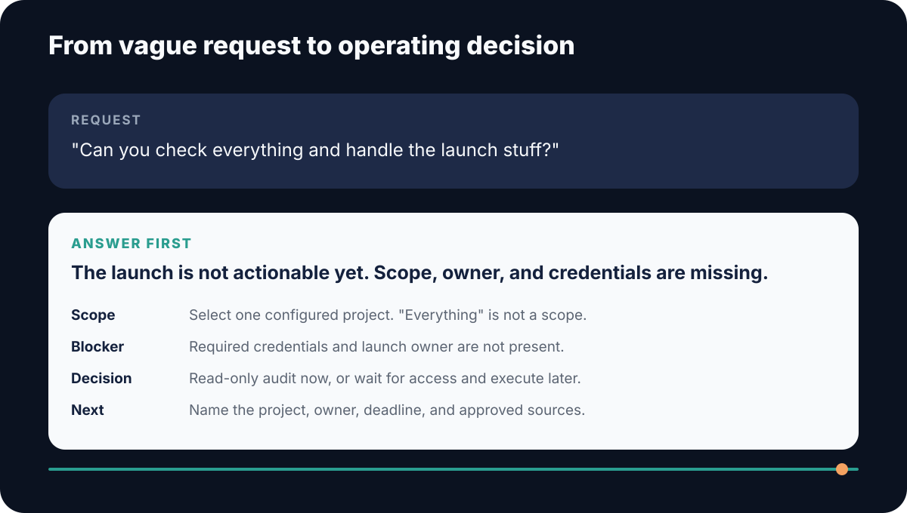

<p align="center">
  
</p>

<p align="center">
  <strong>Give ChatGPT Work and Codex one scoped operating Chief instead of a pile of tools to negotiate.</strong>
</p>

<p align="center">
  <a href="https://github.com/plotdevice01/codex-chief-of-staff/releases"></a>
  <a href="https://github.com/plotdevice01/codex-chief-of-staff/actions/workflows/validate.yml"></a>
  <a href="LICENSE"></a>
  
</p>

Chief of Staff adds durable operating judgment across ChatGPT Work and Codex:

- explicit project scope and source order;
- account identity checks before connector access;
- approval gates for drafts and external writes;
- fail-safe `AGENTS.md` loaders without erasing local rules;
- default ICM task contracts and automatic project architecture;
- 85% compression and `caveman` mode;
- a retained, traceable technical-assistant persona;
- one mandatory content route with pinned Brand Voice, Crafty, and AI Sloppy Copy resources.
- one Agent Plugins skill that routes all supported work without specialist selection.

## Install from this repository

Chief is installed from this GitHub repository. This project does not claim an
OpenAI review, approval, directory listing, or store distribution.

### Windows

```powershell
git clone https://github.com/plotdevice01/codex-chief-of-staff.git
Set-Location .\codex-chief-of-staff
.\install.ps1
```

### macOS or Linux

```bash
git clone https://github.com/plotdevice01/codex-chief-of-staff.git
cd codex-chief-of-staff
./install.sh
```

The installer registers the checked-out repository with Codex, installs
`chief-of-staff@codex-chief-of-staff`, and initializes a private local
configuration when Python is available. Restart Codex, review the Chief hooks,
and start a fresh task after installation.

AI Sloppy Copy, Brand Voice Factory, and Crafty Carousels are upstream source
products. They are already pinned inside Chief and are not separate user
installs.

## Current authority model

Chief uses durable local policy, not an expiring or time-boxed mode. Connector
access starts disabled. External writes are either blocked or require explicit
confirmation. Authority changes only when the workspace owner deliberately
updates the private configuration.

## What changed in v2.1.2

- Fixed project-loader synchronization so it replaces only Chief's managed
  block and preserves every project-owned instruction outside that block.
- Added regression coverage for project text before, between, and after Chief's
  managed sections.
- Removed obsolete OpenAI submission scaffolding.
- Corrected both repository installers so upgrade mode re-registers the local
  checkout instead of calling a Git-only marketplace command.
- Rebuilt the repository release and installed cache from the same canonical
  source and version.

### Distribution corrections from v2.1.1

- Made the GitHub repository and its bundled installer scripts the only
  documented installation path.
- Removed unperformed OpenAI submission, approval, directory, and workspace
  rollout steps from public installation guidance.
- Marked AI Sloppy Copy as an upstream factory. Brand Voice Factory and Crafty
  Carousels have the same role. None is a separate team-facing install.
- Runtime behavior is unchanged from `v2.1.0`; its accepted model and host
  evidence is carried forward under the documentation-only patch rule.

### Runtime foundation from v2.1.0

- Chief is the only discoverable route for business, creative, research,
  operational, document, technical, connected-app, and client-delivery work.
- A universal request contract classifies once and loads only the selected
  internal contracts. It validates the complete result and returns a receipt.
- Chief vendors exact released runtime files from pinned sources:
  - AI Sloppy Copy `0.5.0`;
  - Brand Voice Factory `0.2.1`;
  - Crafty Carousels `0.6.1`.
  The bundled manifest locks the source commit. It also locks each file hash
  and byte count.
- Paid ads and organic social query all 751 hooks before drafting. The same
  query covers seven script frameworks and 39 CTAs. Paid video checks offer
  compatibility and first-frame action. It also checks visual progression and
  true concept variation.
- The stale bundled `viral-carousel-factory` copy is removed. Current Crafty
  production controls now live behind the Chief content route.
- AI Sloppy Copy activation happens in the content contract. No extra content
  hook or separate specialist installation is required.
- Chief now reports an execution trace that proves whether requested skills and
  plugins were materially used instead of merely loaded and name-dropped.
- The active package targets ChatGPT Work and Codex only. Legacy third-party
  host manifests, installers, templates, validators, and acceptance requirements are removed.

### Preserved from v1.0.0

- Every non-trivial task uses a compact ICM contract for scope, exact inputs,
  one job, relevant references, output, observable status, and human review.
- Every new project or workspace automatically loads the internal ICM Architect
  workflow. Recurring processes load it too. Full folders appear only when
  persistent work needs them.
- A pre-tool privacy check blocks configured project or connector values when
  the current prompt did not supply them.
- Restructure mode limits inventory reads and blocks mutation until approval.
  It requires reference checks plus content proof before a deletion proposal.
- The bundled Architect is pinned to `RinDig/icm-architect` commit `8f9cdf9`.
  It includes five workspace forms and ten invariants. Both operating modes are
  present. Codex `AGENTS.md` routing and the cold walk are included. Chief
  safety controls remain active.
- The repository now carries Layer 1 routing and an ICM release pipeline.
  It also includes a conformance matrix and deterministic validation. Failure fixtures cover rejected paths.
- AI Sloppy Copy 0.5.0 with Standard 2.2.0 is pinned inside Chief.
- The retained persona stays unchanged at 97 requirements. The current
  integration contract has ten rules and fifteen live acceptance scenarios.
- Static validation and recorded host receipts remain separate evidence. A
  repository install still requires fresh-task verification in the user's host.

## Version numbers

These numbers describe different products or contracts. They are not competing
versions of the same file.

| Number | What it contains | What users install or cite |
|---|---|---|
| Chief of Staff `2.1.2` | The plugin, Agent Plugins manifest, Chief workflows, hooks, ICM, and bundled content runtime | Install or cite `2.1.2` |
| AI Sloppy Copy `0.5.0` | Canonical source for the pinned checker and copy workflow | Bundled; install separately only for direct development |
| AI Sloppy Copy Standard `2.2.0` | The writing-rules contract inside the pinned checker | Cite the Standard when discussing rule behavior |
| Brand Voice Factory `0.2.1` | Canonical source for the pinned voice-package workflow | Bundled; install separately only for direct development |
| Crafty Carousels `0.6.1` | Canonical source for the pinned carousel workflow and content libraries | Bundled; install separately only for direct development |

Chief and AI Sloppy Copy now use the same three-part product version on their
GitHub release, tag, ZIP, and manifests. A manifest is host metadata inside a
release. It is not another product.

## v2.1.2 validation status

`v2.1.2` contains the Chief skill and its internal contracts. It contains the
hooks and bundled content runtime. Repository installers and deterministic
validators are included. Repository tests do not establish OpenAI approval or
directory publication. They also do not replace a fresh-task check after
installation.

### Configure and validate

In the fresh task, ask:

```text
Use the Chief of Staff skill to initialize my local configuration, then
validate the install. Report any missing bundled runtime file or hook.
```

Installation activates no connector or project access. Those remain off until
the local configuration explicitly turns them on.

## Configure

Start a fresh task and ask:

```text
Use the Chief of Staff skill to initialize my local configuration.
```

The initializer creates a private `chief-of-staff.json` in the platform
configuration directory. Connectors remain disabled and projects remain empty
until the user adds them.

From the cloned repository:

```powershell
py -3 .\scripts\configure.py init --owner "Your Name" --timezone "Etc/UTC"
py -3 .\validate_install.py --strict-dependencies
```

On macOS or Linux, use `python3` and forward-slash paths.

See [installation](docs/installation.md) and
[configuration](docs/configuration.md) for the complete paths, upgrade,
uninstall, and recovery procedures.

## What changes

| Without Chief of Staff | With Chief of Staff |
|---|---|
| Work starts before scope is named | One scope is selected first |
| A connected account is assumed correct | Live identity must match configuration |
| Project instructions can overwrite each other | Shared and project rules remain separate |
| Context and state are improvised per task | ICM names inputs, output, state and review |
| External writes inherit vague approval | Every write follows an explicit policy |
| Long answers bury the decision | The result leads; risks and the next action follow |
| Persona claims are prose | 97 requirements and fifteen scenarios are traceable |

## How it works

<p align="center">
  
</p>

The plugin is skills-only. It does not run a server or add connector access.
Codex lifecycle hooks load the generic operating contract and retained persona
once and omit duplicate injection when the instruction chain already contains
the canonical block. Project loaders retain local rules and provide an explicit
fallback if a Codex hook is absent.
Private identities, scopes, paths, and approvals live in a local ignored
configuration.

The shared contract applies the compact ICM task kernel by default. The bundled
ICM Architect skill handles project and workspace design through five forms.
It loads only the form reference and files needed for the current job.

Read the [architecture](docs/architecture.md) for configuration resolution and
hook behavior. It also covers trust boundaries and project propagation.

## Behavior example

<p align="center">
  
</p>

The sarcasm applies to direct replies when useful. It does not leak into
client-facing, legal, medical, executive, or external communication unless the
user explicitly asks.

## Validate

```powershell
py -3 .\Test-Persona.py
py -3 .\validate_install.py --example
py -3 .\scripts\validate_repository.py
node tests/test_hooks.js
py -3 .\tests\test_icm.py
py -3 .\tests\test_release.py
py -3 .\tests\test_sync.py
py -3 .\scripts\build_release.py --output dist
```

Static tests verify:

- 97 persona requirements and source hashes;
- ten integration rules and fifteen live acceptance definitions;
- five ICM forms and ten invariants, plus cold-walk failure behavior and token budgets;
- communication and safety defaults;
- plugin, hook, skill, configuration, and release version parity;
- public-file privacy scanning;
- Codex lifecycle hook output;
- ICM prompt classification and correction limits;
- recovery plus pre-tool and final-response privacy checks;
- deterministic release contents;
- the pinned content manifest and all 751 hooks;
- seven scripts and 39 CTAs;
- the bundled final checker.

The fifteen prompts in `persona/persona-contract.json` still require a fresh host
session. Static tests cannot grade live model behavior without becoming test
theater.

## Why one plugin and internal source products

Chief of Staff contains the complete retained persona and response modes. It
also carries account gates and project routing. Universal task routing is built
in. Chief remains the only discoverable skill the team needs.
[AI Sloppy Copy](https://github.com/plotdevice01/ai-sloppy-copy),
[Brand Voice Factory](https://github.com/plotdevice01/brand-voice-factory), and
[Crafty Carousels](https://github.com/plotdevice01/crafty-carousels-skill)
remain the canonical source products. Chief vendors their pinned runtime files
so teams do not negotiate three extra plugins for every content request.

See [dependencies](docs/dependencies.md) for ownership and minimum versions.

## Documentation

- [Installation and upgrades](docs/installation.md)
- [Configuration](docs/configuration.md)
- [Architecture](docs/architecture.md)
- [ICM conformance](docs/icm-conformance.md)
- [Testing](docs/testing.md)
- [Release process](docs/release-process.md)
- [Examples](examples/example-interactions.md)
- [Changelog](CHANGELOG.md)

## Security and privacy

Never commit `chief-of-staff.json`. The repository excludes it, release
automation scans for private values, and the plugin does not send telemetry.

Read [SECURITY.md](SECURITY.md) and [PRIVACY.md](PRIVACY.md).

## License

[MIT](LICENSE)
